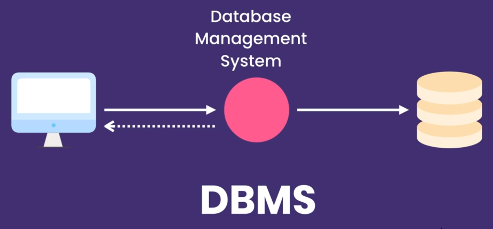
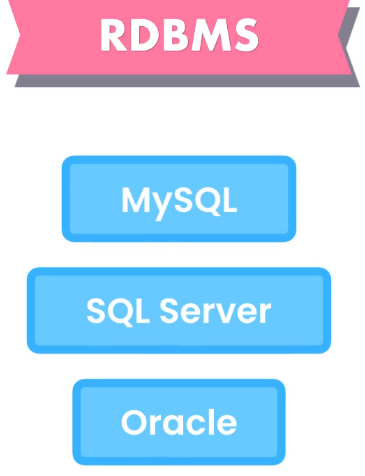

## [SQL-15] SQL Mastery

#### [Module-1] Getting Started

> [**DBMS**](https://www.javatpoint.com/dbms-tutorial) - Database Management System

- Database management system is a software which is used to manage the database. For example: [MySQL](https://www.javatpoint.com/mysql-tutorial), [Oracle](https://www.javatpoint.com/oracle-tutorial), etc are a very popular commercial database which is used in different applications.
- DBMS provides an interface to perform various operations like database creation, storing data in it, updating data, creating a table in the database and a lot more.
- It provides protection and security to the database. In the case of multiple users, it also maintains data consistency.

There are two categories of **DBMS**:

- Relational (SQL) - data stored in tables that are linked using relationships.
- Non-relational (NoSQL)

> **SQL** - Structured Query Language, and it is pronounced as S-Q-L or sometimes as See-Quell. 

This database language is mainly designed for maintaining the data in relational database management systems. It is a special tool used by data professionals for handling structured data (data which is stored in the form of tables).

> **RDBMS** - Relational Data Base Systems

To create Database and fulfill it with content one should use:

- [create-databases.sql](./files/create-databases.sql)

OR create each one separately

- [create-db-hr.sql](./files/create-db-hr.sql)
- [create-db-inventory.sql](./files/create-db-inventory.sql)
- [create-db-invoicing.sql](./files/create-db-invoicing.sql)
- [create-db-store.sql](./files/create-db-store.sql)

During and after the course the [SQL-Cheat-Sheet.pdf](./files/SQL-Cheat-Sheet.pdf) might also be useful
